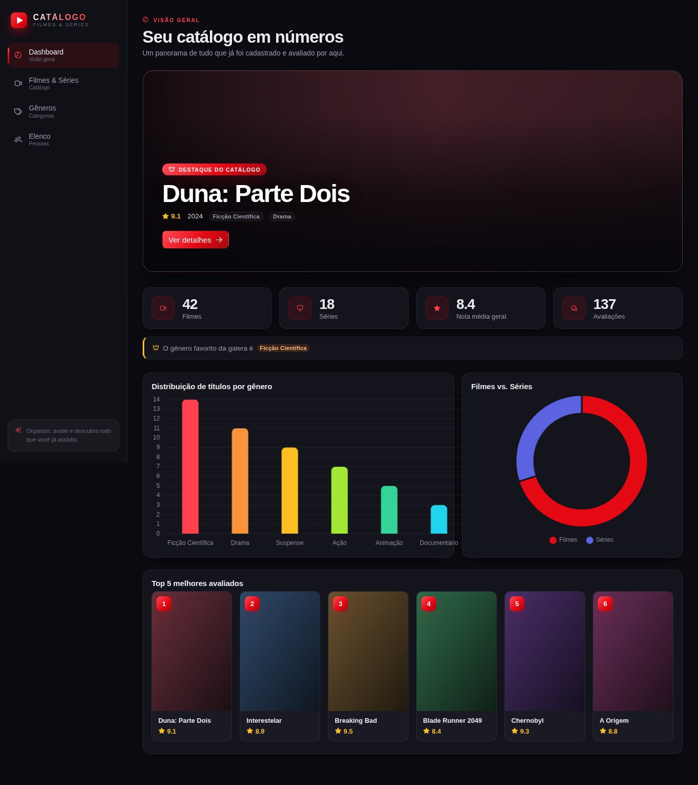
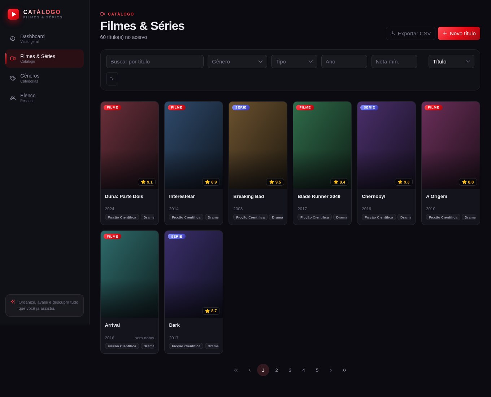
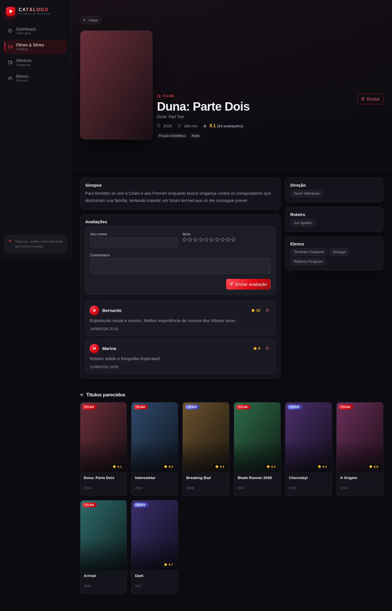
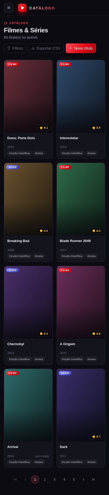

<div align="center">

# 🎬 Catálogo de Filmes e Séries

**Organize, avalie e descubra filmes e séries — tudo em um só lugar.**


</div>

<br>

Projeto pessoal de estudo: um catálogo completo de filmes e séries, com elenco, gêneros, avaliações e um dashboard com estatísticas. Sistema aberto, sem login — é só entrar e usar.

<br>

## 📸 O sistema

<div align="center">

**Dashboard** — destaque do catálogo, indicadores, gráficos e top 5



<br><br>

**Catálogo** — busca, filtros, ordenação e exportação



<br><br>

**Detalhe do título** — ficha completa, elenco e avaliações



<br><br>

**Responsivo** — a navegação vira menu lateral no celular



</div>

<br>

## ✨ Funcionalidades

| Área | O que dá pra fazer |
|---|---|
| 🎞️ **Títulos** | Cadastrar, editar e excluir filmes e séries com pôster, sinopse, ano, duração (ou temporadas/episódios), gêneros e elenco |
| 🔍 **Busca** | Filtrar por título, gênero, tipo, ano e nota mínima; ordenar por qualquer campo e navegar por páginas |
| ⭐ **Avaliações** | Dar nota de 0 a 10 com comentário — a média do título é recalculada na hora |
| 🎭 **Gêneros** | CRUD completo; clicar em um gênero leva ao catálogo já filtrado |
| 👥 **Elenco** | Cadastrar atores, diretores e roteiristas, com foto, biografia e filmografia |
| 📊 **Dashboard** | Totais, nota média geral, gênero mais avaliado, distribuição por gênero, filmes vs. séries e top 5 |
| 📥 **Exportação** | Baixar o resultado da busca atual em CSV |

<br>

## 🚀 Como rodar

Com [Docker](https://www.docker.com/) instalado, um único comando sobe o banco, a API e o site:

```bash
docker compose up --build
```

<div align="center">

| | |
|---|---|
| 🖥️ **App** | http://localhost:4200 |
| ⚙️ **API** | http://localhost:8080/api |
| 📘 **Swagger** | http://localhost:8080/q/swagger-ui |

</div>

O banco já sobe populado com alguns filmes, séries e avaliações de exemplo.

<br>

<details>
<summary><strong>Prefere rodar sem Docker? (modo desenvolvimento)</strong></summary>

<br>

**Backend** — requer Java 21 e um PostgreSQL local (banco `catalogo`, usuário `postgres`, senha `1234` por padrão):

```bash
cd backend
./mvnw quarkus:dev
```

Se seu Postgres usa outras credenciais, exporte antes de rodar:

```bash
export DB_URL=jdbc:postgresql://localhost:5432/catalogo
export DB_USERNAME=meu_usuario
export DB_PASSWORD=minha_senha
```

Sem Postgres instalado? Tendo Docker disponível, remova as três linhas `%dev.quarkus.datasource.*` de `backend/src/main/resources/application.properties` — o Quarkus sobe um banco descartável sozinho.

**Frontend** — requer Node.js 20+:

```bash
cd frontend
npm install
npm start
```

</details>

<br>

## 🧩 Como funciona

O projeto tem duas peças que conversam por uma API REST em JSON:

```
Angular (:4200)  ──HTTP──▶  Quarkus (:8080)  ──JDBC──▶  PostgreSQL (:5432)
```

**Backend** segue uma divisão em camadas — `resource` (endpoints REST) → `service` (regras de negócio e transações) → `repository` (acesso a dados com Panache). Os DTOs isolam a API das entidades, o MapStruct faz a conversão entre eles e os `exception mappers` traduzem erros em respostas HTTP padronizadas. O schema e os dados de exemplo são versionados em migrations Flyway.

**Frontend** é Angular standalone com lazy loading por rota. Cada tela vive em `features/`, os serviços HTTP e modelos ficam em `core/`, e um interceptor central captura erros da API e mostra um toast. O estado das telas usa signals.

```
backend/src/main/java/com/catalogo/
├── resource/     endpoints REST
├── service/      regras de negócio
├── repository/   consultas (Panache)
├── mapper/       entidade ⇄ DTO (MapStruct)
├── entity/       modelo de dados
├── dto/          contratos da API
└── exception/    tratamento de erros

frontend/src/app/
├── core/         serviços, modelos, interceptor e tema
└── features/     dashboard, títulos, gêneros e pessoas
```

<br>

<details>
<summary><strong>Principais endpoints</strong></summary>

<br>

| Método | Rota | Descrição |
|---|---|---|
| `GET` | `/api/titulos` | Lista com filtros (`titulo`, `generoId`, `tipo`, `ano`, `notaMin`), paginação (`page`, `size`) e ordenação (`sort`, `direction`) |
| `GET` | `/api/titulos/{id}` | Detalhe com gêneros, elenco e avaliações |
| `POST` `PUT` `DELETE` | `/api/titulos` `/api/titulos/{id}` | CRUD de títulos |
| `GET` `POST` | `/api/titulos/{id}/avaliacoes` | Lista e cria avaliações de um título |
| `PUT` `DELETE` | `/api/avaliacoes/{id}` | Edita e remove uma avaliação |
| `GET` `POST` `PUT` `DELETE` | `/api/generos` | CRUD de gêneros |
| `GET` `POST` `PUT` `DELETE` | `/api/pessoas` | CRUD de pessoas (atores, diretores, roteiristas) |
| `GET` | `/api/estatisticas` | Números do dashboard |

A documentação completa fica no Swagger: http://localhost:8080/q/swagger-ui

</details>

<br>

## 🛠️ Tecnologias

**Backend:** Java 21 · Quarkus · Hibernate + Panache · MapStruct · Flyway · OpenAPI/Swagger
**Frontend:** Angular (standalone) · PrimeNG · Chart.js
**Infra:** PostgreSQL · Docker Compose

<br>

<div align="center">

*Feito para fins de estudo e prática de full-stack.* 💛

</div>
